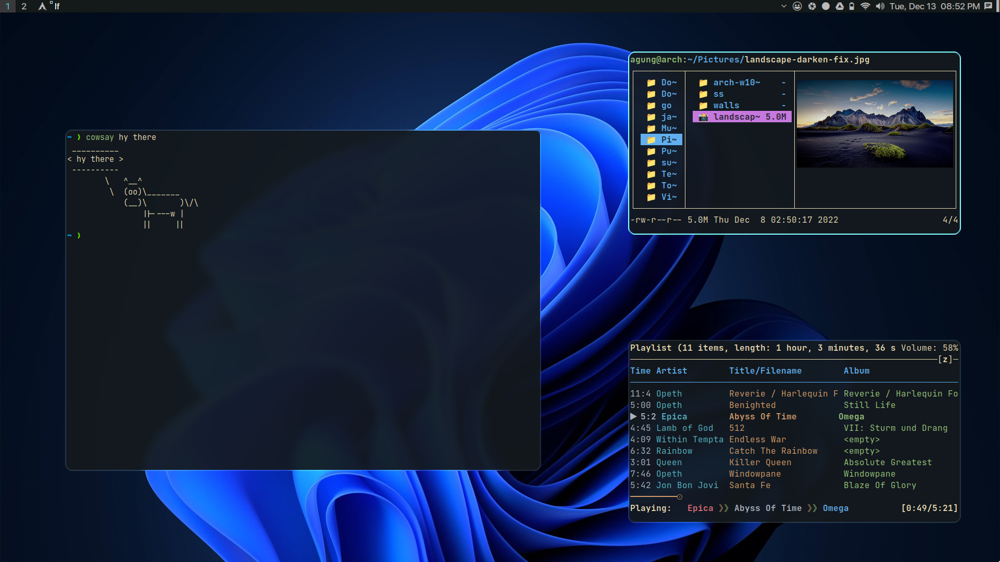

<h1 align="center">My Arch Linux Setup</h1>
<p align="center">suckless, <a href="https://github.com/agung-satria/nvimnew" target="_blank">nvim</a>, script, config, apps, notes, etc</p>




## Dependencies!

```sh
sudo pacman -S base-devel xorg-server xorg-xinit libx11 libxinerama libxft webkit2gtk
sudo pacman -S wget curl rsync tree fzf tmux nano imagemagick
sudo pacman -S nemo nemo-fileroller font-manager
sudo pacman -S simplescreenrecorder flameshot maim
sudo pacman -S dunst libnotify calcurse bc hsetroot xclip pulsemixer
sudo pacman -S pamixer light expac
sudo pacman -S ttf-joypixels ttf-font-awesome
sudo pacman -S ntfs-3g mtpfs gvfs-mtp gvfs-gphoto2
sudo pacman -S galculator rofi arandr vlc
sudo pacman -S zip unzip unrar gzip
```

## Change console font (make it bigger)

```sh
ls /usr/share/kbd/consolefonts
sudo pacman -S terminus-font
sudo echo "FONT=ter-u32n.psf.gz" >> /etc/vconsole.conf
reboot
```

## Install fonts

```sh
git clone https://github.com/agung-satria/fonts.git
mkdir ~/.fonts
copy font that required to `~/.fonts` directory
sudo fc-cache -fv
or
refont
```

## Install suckless software

```sh
sudo make install
```

## AUR helper (yay)

```sh
cd /tmp
git clone https://aur.archlinux.org/yay-git.git
cd yay-git
makepkg -si
```

## AUR packages

- yay -S noto-color-emoji-fontconfig (color emoji!)
- yay -S brave-bin
- yay -S mirage (image viewer)
- yay -S gotop
- yay -S grabc (sometimes not working)
- yay -S picom-jonaburg-git (for nice rounded corners/used) or
- yay -S picom-pijulius-git (for nice animation)
- yay -S ttf-ms-fonts
- yay -S colorpicker
- yay -S 7-zip

## Install tmux

See README in `tmux/README.md`

## Install zsh

See README in `zsh/README.md`

## Install ranger or lf file manager

See README in `.config/{ranger/README.md,../.config/lf/README.md}`

## Media player

```sh
sudo pacman -S mpc mpd ncmpcpp mpv
cp -R .config/{mpd,ncmpcpp,mpv} ~/.config
```

## Theming

```sh
sudo pacman -S papirus-icon-theme lxappearance
```

Install from file

- Extract the files in the _usr/share/icons_ and _usr/share/themes_ folder to each specified directory
- And change icon and theme using _lxappearance_

## Install rofi

Copy config file

```sh
cp -R .config/rofi ~/.config
```

Change rofi themes:

- Use `vr` (aliased to nvim ~/.config/rofi/config.rasi)
- Uncomment line 15 in _config.rasi_ to use [siduck](https://github.com/siduck/chadwm/tree/main/rofi) theme
- Change/uncomment last line/section to use other themes (windows11, launchpad, etc)
- Use `rofi-theme-selector` to select a theme that isn't in the file (make sure to put that in _themes_ directory)

## Default applications

```sh
Nemo 'xdg-mime default nemo.desktop inode/directory application/x-gnome-saved-search'
```

## Nemo preview

- Edit - Preferences - Preview
- _Only for files smaller than_ set to 1GB

## Pacman character (ILoveCandy)

```sh
sudo nvim /etc/pacman.conf
```

on section 'Misc options'

- uncomment '#Color'
- add 'ILoveCandy' below '#VerbosePkgLists' line
- soo it will look like this

```
# Misc options
#UseSyslog
Color
#NoProgressBar
CheckSpace
#VerbosePkgLists
ILoveCandy
#ParallelDownloads = 5
```

## Enable tap to Click

```sh
sudo cp /usr/share/X11/xorg.conf.d/40-libinput.conf /etc/X11/xorg.conf.d
sudo nvim /etc/X11/xorg.conf.d/40-libinput.conf

sudo echo "Section "InputClass"
	Identifier "devname"
	Driver "libinput"
	Option "Tapping" "on"
	Option "NaturalScrolling" "true"
EndSection" >> /etc/X11/xorg.conf.d/40-libinput.conf
```

Section

```sh
Section "InputClass"
	Identifier "devname"
	Driver "libinput"
	Option "Tapping" "on"
	Option "NaturalScrolling" "true"
EndSection
```

Restart DWM

## Disable power button

```
sudo nvim /etc/systemd/logind.conf
```

Set this value
`HandlePowerKey=ignore`
Reboot

## Install lockscreen

```sh
`https://github.com/Raymo111/i3lock-color` (yay -S i3lock-color)
`https://github.com/betterlockscreen/betterlockscreen` (build manual like on ubuntu)
```

## Pacman command

```sh
sudo pacman -Rsn $(pacman -Qdtq)
sudo pacman -Scc
sudo pacman -Rscnd <program>

```

## Command

```sh
`sudo timedatectl set-ntp true` set time automatically
```

## Mounting

```sh
mkdir ~/w10
lsblk
sudo mount /dev/nvme0n1p5 w10
sudo umount /dev/nvme0n1p5 ~/w10
```

nvme0n1p5 (data D windows)

## Speed up booting time

- `sudo nvim /etc/default/grub`
- set _`GRUB_TIMEOUT=1`_ or _`GRUB_TIMEOUT=0`_
- `sudo grub-mkconfig -o /boot/grub/grub.cfg`
- reboot
